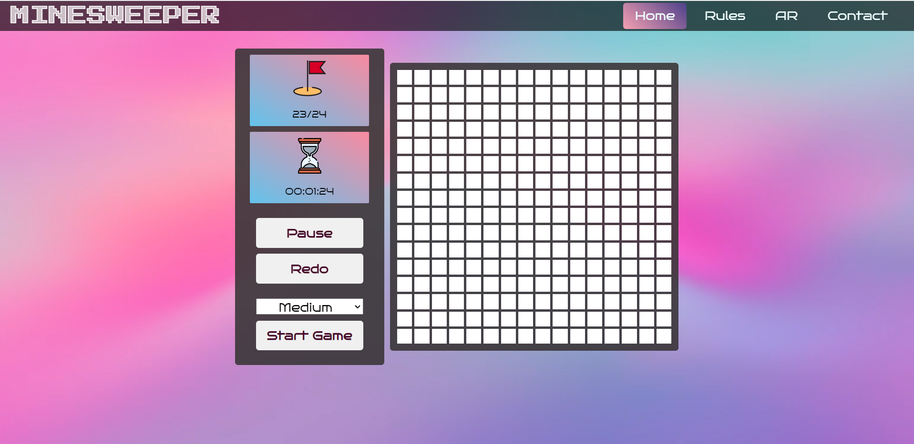
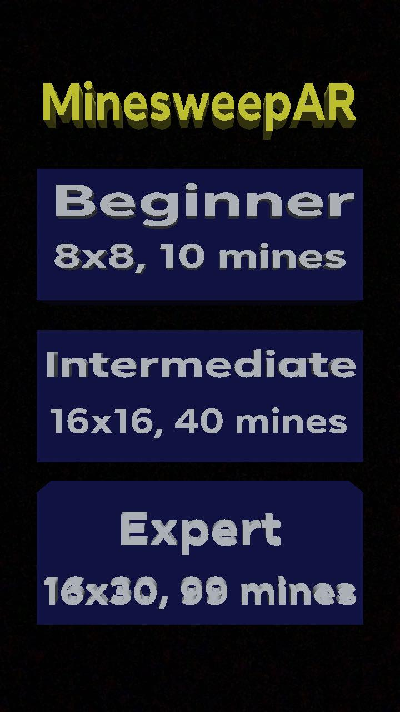
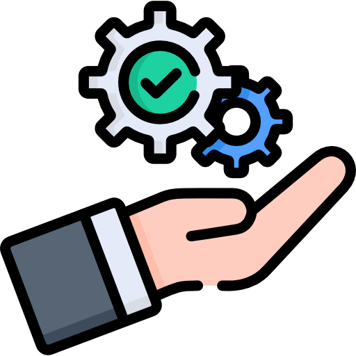

# Minesweeper
<h2>Welcome to our project. We are team ... of DSA group. Our members include: </h2>
<h3>
  <li>Hồ Hữu Hiệp ITITIU20202</li>
  <li>Nguyễn Thanh Hiền ITITIU20142</li>
  <li>Lê Quý Minh Đức ITITIU20188</li>
  <li>Tạ Vĩ Khang ITITIU20226</li>
  <li>Lê Hoàng Thái Tuấn ITITIU20340</li>
</h3>

This README contains all about the creating of MINESWEEPER game by using HTML,CSS and JS. Also,we have applied the Augmented Reality (AR) technology to play game to give you have a new experience 

<h2>Here is the table of contents:</h2>
<h3>
 <ol>
    <li>Description</li>
    <li>Gameplay</li>
    <li>Platform</li>
    <li>Tutorial</li>
    <li>Features</li>
    <li>Scope</li>
    <li>Contribution</li>
    <li>Documentation</li>
 </ol>
</h3>  

<h2> 1. DESCRIPTION</h2>

MINESWEEPER is a classic puzzle game that challenges your strategic thinking and deduction skills. Embark on a thrilling adventure as you navigate through a minefield, carefully revealing hidden mines while avoiding dangerous explosions. With its simple yet addictive gameplay, Minesweeper offers hours of entertainment for players of all ages.

Explore a grid of tiles, each concealing a number or a hidden mine. The numbers indicate how many mines are adjacent to a particular tile, guiding you in your quest to identify and mark the mines correctly. But be cautious! A single wrong move can trigger a catastrophic chain reaction, ending your game. As you progress, the minefields become increasingly challenging, testing your ability to analyze patterns and make precise decisions.

MINESWEEPER features customizable difficulty levels, allowing both beginners and experienced players to enjoy the game at their preferred pace. Unleash your problem-solving prowess, improve your best scores, and compete with friends to claim the top spot on the leaderboard.

With its nostalgic charm and captivating gameplay, MINESWEEPER is the ultimate test of your logic and deduction skills. Prepare yourself for a mind-boggling adventure and unravel the mysteries hidden beneath the surface!

<h2> 2. GAMEPLAY</h2>

All you need to do in this solving game is find and determine all of the mines are hidden under the squares in the definitely area. We will provide for you the flags to mark the square you think has a mine. Moreover, to exactly know which places will contain the mine, you need to check the square has a number that you have opened or it appeared before. The number you see on the square is the way for you to find the solution, it will represent all the mines have under the 3x3 area- which the square contains number is the center.Example: The center square of the 3x3 area is "2", which means there are 2 mines around (both mines are marked by flags).The image will explain to you specifically about that is:

<b>Figure: Example</b>

The game is ended whenever you find the mines and open all the squares that don't have mine under.

You had no idea what happened when you opened the square. Maybe the first time you touch the first square, you'll get a mine and lose the game. Isn't it difficult to play? That's why we provide a redo button </img> to assist you have a wonderful experience. This button will take you back to the last time you touched the mine, whether it was the first time or whenever you opened the squares, and offer you another chance to find new way to live.

<h2> 3. PLATFORM</h2>

We using 2 platforms to let you play this game by using web browser and AR mode using facebook camera app.

<h3>Here is the platform of web browser:</h3>

<b>Figure: Web browser platform</b>

<h3>To use AR mode, using scanner to scan this picture below (we also add AR mode directly to the web browser).</h3>
<a href='https://www.youtube.com/watch?v=xvFZjo5PgG0'>Click here to scan!</a>
<h3>Platfrom of AR mode</h3>

<b>Figure: AR platform</b>

<h4>Note: To run the web browser, please download the .zip file and run 'index.html'.</h4>

<h2> 4. TUTORIALS</h2>
<h3>First, we want to guide you the basic of how to play this game from web browser:</h3>
<ul>
   <li>Select the level to play the game.</li>
   <li>Click start to render the game.</li>
   <li>From the game, left-click in any square to open it.</li>
   <li>Right-click to put the flag in the squares you want.</li>
   <li>Right-click in the square that has flag once again to create the predict flag.</li>
   <li>In the 3x3 area, if the center square contains number and around it has enough flag similar to the number, left-click to open all the squares around automatically.</li>
   <li>You can redo the game many times when you open and receive the mines. Click the redo button to rollback your choices.</li>
   <li>Click restart button or select different level when you want to create a new game. <li>
</ul>
<h3>Next, we also guide you how to play this game on AR mode</h3>
<ul>
   <li>Note: AR mode only can use on mobile phone or tablet.</li>
   <li>Find the good place for playing if you don't want to stand and play.</li>
   <li>Select level to play the game.</li>
   <li>After finish rendering, the board will appear and you just touch to open the square.</li>
   <li>There has the flag icon, touch on that to put the flag into where you want. </li>
   <li>In the 3x3 area, if the center square contains number and around it has enough flag similar to the number, touch and hold the square to open all the squares aroud automatically.</li>
   <li>You can redo the game many times when you open and receive the mines. Touch the redo icon to rollback your choices.</li>
   <li>Touch restart, new game or change difficulty icon to select what you want to play (play again, replace new mines or change difficulty).</li>

</ul>

<b>NOTED:</b> Remember to open all the squares that don't include the mine to finish the game

<h2> 5. FEATURES</h2>
 
<h3>This content will explain about which features do we use to build this game</h3>
<ol>
<li><h4>Grid Initialization:</h4></li>
<ul>
  <li>The game initializes a grid of squares, displayed on the board.</li>
  <li>The size of the grid can be adjusted based on the selected level (small, medium, large).</li>
</ul>
<li><h4>Mine Placement:</h4></li>
<ul>
  <li>Mines are randomly placed on the grid.</li>
  <li>The number of mines is determined based on a formula: twice the square root of the grid area.</li>
</ul>
<li><h4>Square Class:</h4></li>
<ul>
  <li>Represents each square on the grid.</li>
  <li>Contains properties such as mine, discovered, adjacentMines, and flagType.</li>
  <li>The flagType property can be set to OK or DOUBT, representing a flagged square or a square with a doubtful flag.</li>
</ul>
<li><h4>Event Listeners:</h4>
<ul>
  <li>Event listeners are added to each square on the grid.</li>
  <li>Left-clicking on a square checks if it contains a mine or adjacent mines.</li>
  <li>Right-clicking on a square places a flag or changes the flag type.</li>
</ul>
<li><h4>Checking for Mines:</h4></li>
<ul>
  <li>When a square is clicked, the game checks if it contains a mine.</li>
  <li>If a mine is found, the game ends, and all mines are revealed.</li>
  <li>If the square has adjacent mines, it reveals the number of adjacent mines.</li>
  <li>If the square has no adjacent mines, it performs a flood-fill algorithm to reveal surrounding squares.</li>
</ul>
<li><h4>Flagging and Doubting:</h4></li>
<ul>
  <li>Right-clicking on a square toggles between placing a flag and doubting the presence of a mine.</li>
  <li>The number of flagged squares is displayed, indicating the remaining mines.</li>
</ul>  
<li><h4>Timer and Stopwatch:</h4></li>
<ul>
  <li>The game includes a timer that tracks the elapsed time.</li>
  <li>The stopwatch function updates the timer display every second.</li>
  <li>The timer starts when the first square is clicked.</li>
</ul>
<li><h4>Pause and Continue:</h4></li>
<ul>
  <li>The game includes a pause button that pauses or resumes the game.</li>
  <li>When paused, the grid becomes hidden, and the timer stops.</h4>
</ul>
<li><h4>Restarting the Game:</h4>
<ul>
  <li>The game can be restarted by selecting a new level.</li>
  <li>It clears the grid, resets variables, and generates a new grid with mines.</li>
</ul>
<li><h4>User Interface:</h4>
<ul>
  <li>The game interface includes a board, a grid to display squares, and buttons for pause and restart.</li>
  <li>The number of remaining mines is displayed.</li>
  <li>The game also includes a hamburger icon that expands or collapses the navigation bar.</li>
</ul>
</ol>

<h2>6. SCOPE</h2>
<h3>In the future, we have some plan for improving the quality of MINESWEEPER. There are about:</h3>

-
-
-
-
-

<h2> 7. CONTRIBUTION</h2>

<h4>
  <li>AR building: Hồ Hữu Hiệp</li>
  <li>Main web browser building: Nguyễn Thanh Hiền</li>
  <li>Support: Lê Quý Minh Đức, Tạ Vĩ Khang, Lê Hoàng Thái Tuấn</li>
</h4>

<h2> 8. DOCUMENTATION</h2>
